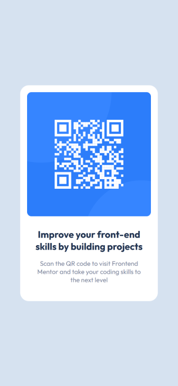
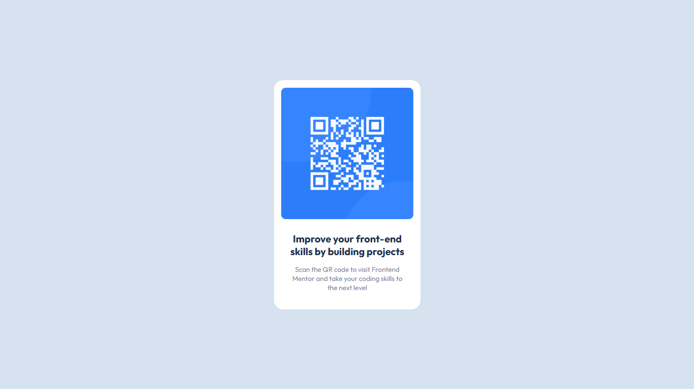

# Frontend Mentor - Solução para o componente de código QR

Esta é a minha solução para o [desafio do componente de código QR no Frontend Mentor](https://www.frontendmentor.io/challenges/qr-code-component-iux_sIO_H). Os desafios do Frontend Mentor nos ajudam a melhorar as nossas habilidades de codificação através da construção de projetos realistas.

## Índice

- [Frontend Mentor - Solução para o componente de código QR](#frontend-mentor---solução-para-o-componente-de-código-qr)
  - [Índice](#índice)
  - [Visão Geral](#visão-geral)
    - [O Desafio](#o-desafio)
    - [Links](#links)
  - [Meu processo](#meu-processo)
    - [Construído com](#construído-com)
    - [O que eu aprendi](#o-que-eu-aprendi)
      - [Flex-Box](#flex-box)
      - [Viewport](#viewport)
    - [Desenvolvimento contínuo](#desenvolvimento-contínuo)
    - [Recursos úteis](#recursos-úteis)
  - [Desenvolvedor](#desenvolvedor)


## Visão Geral

### O Desafio

Com base nos meus conhecimentos adquiridos, desenvolver as página abaixo com HTML e CSS:

| Mobile                                                  | Desktop                                            |
| ------------------------------------------------------- | -------------------------------------------------- |
|  |  |


### Links

- Solução URL: [QR code component - (HTML, CSS, Flex-Box e Viewport)](https://www.frontendmentor.io/solutions/frontend-mentor-qr-code-component---html-css-flex-box-e-viewport-DECB2zGDiH)
- Site: [Frontend Mentor | QR code component](https://maruanvitorino.github.io/fm-challenge-1-qrcode/)

## Meu processo

### Construído com

- HTML5
- CSS

### O que eu aprendi

Reforcei meus conchecimentos de modo prático sobre a distribuição de elementos utilizando o **Flex-Box** e o posicionamento em relação a área total visível pelo navegador e mobile usando as propriedades do CSS:

#### Flex-Box

O **flex-box** tem o objetivo alinhar os espaços entre os itens dentro de um *container*, com esse desafio foi possivel entender mais a fundo a diferença entre a direção dos itens dentro do container usando ```flex-direction```, o alimento ou a disposição dos itens usando ```justify-content``` e o alinhamento dos itens dentro do container usando ```justify-content``` como a seguir:

```css
    display: flex;
    flex-direction: column;
    justify-content: space-around;
    align-items: center;
```


#### Viewport

O ***vw*** representa a porcentagem da **largura** do viewport, enquanto o ***vh*** representa a porcentagem da **altura**. Com isso torna possível utilizar toda a área visível das telas, distribuindo em porcentagem.

```css
    width: 100vw;
    height: 100vh;
```

### Desenvolvimento contínuo

Uma base sólida para desenvolvimento web consiste em praticar conceitos básicos da internet como HTML, CSS e JavaScript. Um treinamento que recebi na HCode foi incentivado a abordagem Mobile First, os próximos desafios pretendo aprodundar nessa abordagem.

### Recursos úteis

- [Flexbox CSS: Guia Completo, Elementos e Exemplos](https://https://www.alura.com.br/artigos/css-guia-do-flexbox) - Recomendo fortemente esse guia que me ajudou a desenvolver esse desafios explicando com exemplos o Flex-Box.
- [Web Starter HTML & CSS](https://hcode.com.br/cursos/web-starter-html-e-css) - Esse curso me deu uma base sólida sobre diversos conceitos de desenvolvimento web, fica minha recomendação sincera e como ex-aluno. 


## Desenvolvedor

- GitHub - [MaruanVitorino](https://github.com/MaruanVitorino)
- Frontend Mentor - [@MaruanVitorino](https://www.frontendmentor.io/profile/MaruanVitorino)